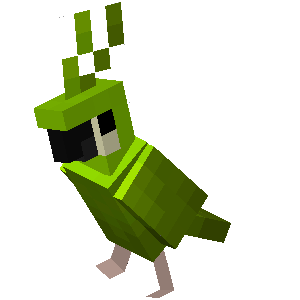
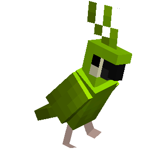

 <a href="https://hits.sh/github.com/piecrusts/"> 
 
  

  

  <table>
    <tr>
      <td align="center">
        &nbsp;&nbsp;&nbsp;
        $\color{#C9A29F}{\textrm{theres something about the truth,}}$
        &nbsp;
        $\color{#dbd0d3}{\textrm{that keep it from being perfect.}}$
      </td>
    </tr>
  </table>

&nbsp;&nbsp;  &nbsp;&nbsp;  &nbsp;&nbsp;  &nbsp;&nbsp;  &nbsp;&nbsp;  &nbsp;&nbsp;  &nbsp;&nbsp;  &nbsp;&nbsp;  &nbsp;&nbsp; $\color{#dbd0d3}\textsf{jas or mixx}$
 
 &nbsp;&nbsp;  &nbsp;&nbsp;  &nbsp;&nbsp;  &nbsp;&nbsp;  &nbsp;&nbsp;  &nbsp;&nbsp;  &nbsp;&nbsp;  &nbsp;&nbsp;  &nbsp;&nbsp; &nbsp;&nbsp; &nbsp;&nbsp; $\color{#dbd0d3}\textsf{minor , aest , lesbaian}$
 
&nbsp;&nbsp;  &nbsp;&nbsp;  &nbsp;&nbsp;  &nbsp;&nbsp;  &nbsp;&nbsp;  &nbsp;&nbsp; $\color{#dbd0d3}\textsf{do not copy or take inspo from any of my skins}$
 
  $\color{#dbd0d3}\textsf{c*h are auto allowed, no need to ask!}$
  
 

  
 ${\textsf{\color{#dbd0d3}  𑣲}}$ ${\textsf{\color{#C9A29F}  friends }}$ 
 
   $\color{#C9A29F}{\textrm{dysmd gc : }}$ <a href="https://github.com/nx2hxn">@nx2hxn</a> <a href="https://github.com/colesbf">@colesbf</a> <a href="https://github.com/norwayapht">@norwayapht</a>  <a href="https://github.com/prwttypup">@prwttypup</a> <a href="https://github.com/tartpaw">@tartpaw</a> <a href="https://github.com/ranpwiz">@ranpwiz</a>  
$\color{#dbd0d3}{\textrm{fat trio : }}$ <a href="https://github.com/nx2hxn">@nx2hxn</a> <a href="https://github.com/colesbf">@colesbf</a>  
$\color{#C9A29F}{\textrm{bday cake trio : }}$ <a href="https://github.com/ccggmadness">@ccggmadness</a> $\color{#dbd0d3}{\textrm{yeva}}$  
$\color{#dbd0d3}{\textrm{oomfies :}}$ <a href="https://github.com/pyrolaand">@pyrolaand</a> <a href="https://github.com/N1TEB0I">@N1TEB0I</a> <a href="https://github.com/sconelet">@sconelet</a> <a href="https://github.com/lexiwasunknown">@lexiwasunknown</a> <a href="https://github.com/lalleshwariii">@lalleshwariii</a> <a href="https://github.com/lottipedei">@lottipedei</a> <a href="https://github.com/CL0UDVEIL">@CL0UDVEIL</a> <a href="https://github.com/TacticalVoid">@TacticalVoid</a> <a href="https://github.com/w2fsz">@w2fsz</a> <a href="https://github.com/ArtistsLeafRibbon">@ArtistsLeafRibbon</a> <a href="https://github.com/FALSE-WORM-KING">@FALSE-WORM-KING</a> <a href="https://github.com/deepaffection">@deepaffection</a> <a href="https://github.com/BunnyCoded">@BunnyCoded</a> <a href="https://github.com/sugurusloverboy">@sugursloverboy</a> <a href="https://github.com/OrinSushiBat">@OrinSushiBat</a> <a href="https://github.com/TheSyndicateSys">@TheSyndicateSys</a>  
 

 
&nbsp;&nbsp;  &nbsp;&nbsp;  &nbsp;&nbsp;  &nbsp;&nbsp;  &nbsp;&nbsp;  &nbsp;&nbsp; <a href="https://guns.lol/anyujins">guns.lol</a> &nbsp;&nbsp;  &nbsp;&nbsp;  &nbsp;&nbsp;  &nbsp;&nbsp;  &nbsp;&nbsp;  &nbsp;&nbsp; $\color{#C9A29F}\textsf{   ⋆}$ &nbsp;&nbsp;  &nbsp;&nbsp;  &nbsp;&nbsp;  &nbsp;&nbsp;  &nbsp;&nbsp;  &nbsp;&nbsp; <a href="https://en.pronouns.page/@nmixes">prns.pg</a></a>

                        
                  

